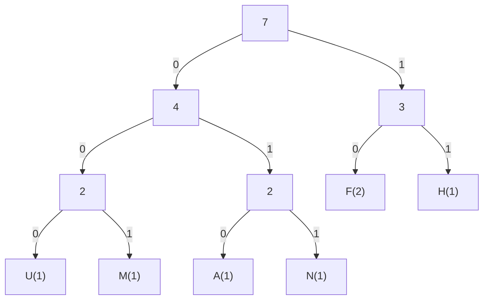

# Lossless Compression

## Variable Length Code (VLC)

The languages we speak have certain traits such as words and letters
that occur more often than other. The following compression algorithms
are designed to shorten the amount of space needed to represent
letters that occur very often in a text.

### Morse Code

The morse code has a fixed set of codes that resemble the probability
of how often the letters appear in words of the language it has been
designed for. The letters that occur more often need less symbols
(`.`/`-`) to be written out.

| Code    | Symbol | Code    | Symbol | Code    | Symbol |
|---------|--------|---------|--------|---------|--------|
| `.-`    | `A`    | `-.`    | `N`    | `.----` | `1`    |
| `-...`  | `B`    | `---`   | `O`    | `..---` | `2`    |
| `-.-.`  | `C`    | `.--.`  | `P`    | `...--` | `3`    |
| `-..`   | `D`    | `--.-`  | `Q`    | `....-` | `4`    |
| `.`     | `E`    | `.-.`   | `R`    | `.....` | `5`    |
| `..-.`  | `F`    | `...`   | `S`    | `-....` | `6`    |
| `--.`   | `G`    | `-`     | `T`    | `--...` | `7`    |
| `....`  | `H`    | `..-`   | `U`    | `---..` | `8`    |
| `..`    | `I`    | `...-`  | `V`    | `----.` | `9`    |
| `.---`  | `J`    | `.--`   | `W`    | `-----` | `0`    |
| `-.-`   | `K`    | `-..-`  | `X`    |
| `.-..`  | `L`    | `-.--`  | `Y`    |
| `--`    | `M`    | `--..`  | `Z`    |

> The international morse code table

### Huffman Code

Other than morse code, the Huffman code is based on binary. Another
difference to morse code is that the "alphabet" is generated to work
especially well for its given context. This means, that all characters
within the input are counted and then the codes are generated to suit
that context.

This is done by constructing a binary tree, which is a tree whose
nodes only ever have two children. Binary trees allow us to label any
junction with zero and one.

The following diagram should illustrate the usage of the algorithm.

> **Example:** HUFFMAN 
> **Result:** 110001010001010011 (18 bit) 
> **Original:** HUFFMAN (7 bytes)

In this example, only the letter `F` occurs more than once. Since
that is a letter that occurs more often, the tree is made so that
only two bits are required to represent this character.

## Run Length Coding (RLC)

## Lempel-Ziv-Welch (LZW)

## Burrows-Wheeler-Transformation
