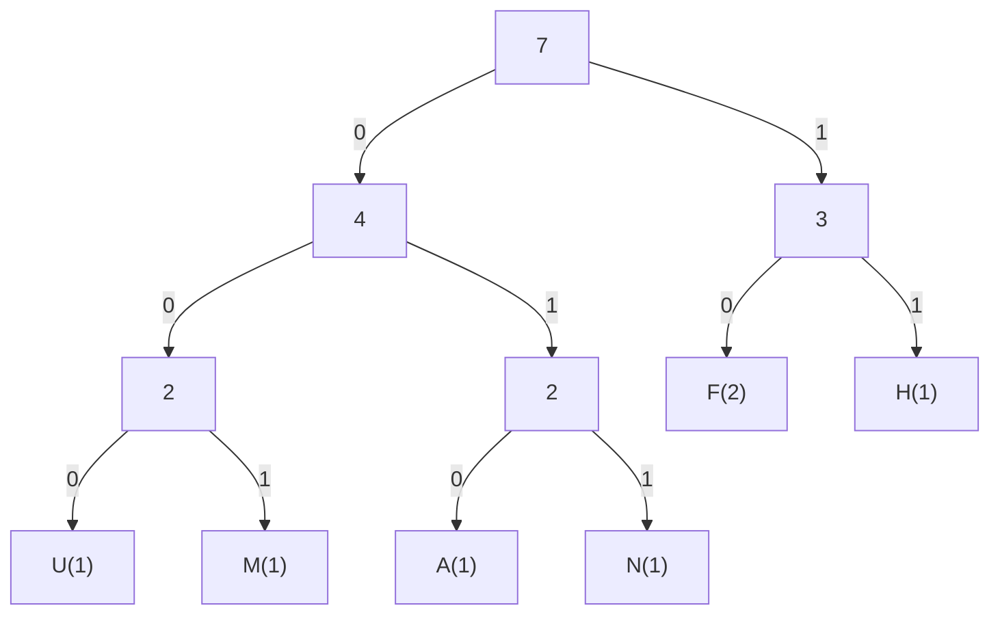

# Lossless Compression

## Variable Length Code (VLC)

The languages we speak have certain traits such as words and letters
that occur more often than other. The following compression algorithms
are designed to shorten the amount of space needed to represent
letters that occur very often in a text.

### Morse Code

The morse code has a fixed set of codes that resemble the probability
of how often the letters appear in words of the language it has been
designed for. The letters that occur more often need less symbols
(`.`/`-`) to be written out.

| Code    | Symbol | Code    | Symbol | Code    | Symbol |
|---------|--------|---------|--------|---------|--------|
| `.-`    | `A`    | `-.`    | `N`    | `.----` | `1`    |
| `-...`  | `B`    | `---`   | `O`    | `..---` | `2`    |
| `-.-.`  | `C`    | `.--.`  | `P`    | `...--` | `3`    |
| `-..`   | `D`    | `--.-`  | `Q`    | `....-` | `4`    |
| `.`     | `E`    | `.-.`   | `R`    | `.....` | `5`    |
| `..-.`  | `F`    | `...`   | `S`    | `-....` | `6`    |
| `--.`   | `G`    | `-`     | `T`    | `--...` | `7`    |
| `....`  | `H`    | `..-`   | `U`    | `---..` | `8`    |
| `..`    | `I`    | `...-`  | `V`    | `----.` | `9`    |
| `.---`  | `J`    | `.--`   | `W`    | `-----` | `0`    |
| `-.-`   | `K`    | `-..-`  | `X`    |
| `.-..`  | `L`    | `-.--`  | `Y`    |
| `--`    | `M`    | `--..`  | `Z`    |

> The international morse code table

### Huffman Code

Other than morse code, the Huffman code is based on binary. Another
difference to morse code is that the "alphabet" is generated to work
especially well for its given context. This means, that all characters
within the input are counted and then the codes are generated to suit
that context.

This is done by constructing a binary tree, which is a tree whose
nodes only ever have two children. Binary trees allow us to label any
junction with zero and one.

The following diagram should illustrate the usage of the algorithm.



> <div>**Example:** HUFFMAN</div>
> <div>**Result:** 110001010001010011 (18 bit)</div>
> <div>**Original:** HUFFMAN (7 bytes)</div>

In this example, only the letter `F` occurs more than once. Since
that is a letter that occurs more often, the tree is made so that
only two bits are required to represent this character.

## Run Length Coding (RLC)

Run length coding is used in cases where there are long strings of
repeating patterns. Instead of writing them out, the algorithm
combines them and stores the data as compact as possible.

For example, let's say we have a bitmap image (only two colors)
that is `5x5` pixels in size:

```plain
+-----+
|.....|
|.xxx.|
|.xxx.|
|.xxx.|
|.....|
+-----+
x: black, ' ': white

Bits: 1111110001100011000111111 (25 bits)
```

Now, we can determin the biggest count of one value repeating. In
this case that would be six. To store the number six, we need at
least three bits which is the value we will use.

We can now simply alter between the values (1/0) and write out the
amount they occur in:

```plain
Result: 110 011 010 011 010 011 110 (21 bits)
```

As we can observe, the run length coding has reduced the size of our
data and we can store it more efficiently.

## Lempel-Ziv-Welch (LZW)

This algorithm does not only take repeating letters into account, but
entire words and sentences if they are identical. Also, in contrast
to the VLC algorithms, LZW does not need a predefined or precomputed
table.

LZW makes use of a temporary dictionary to keep track of patterns it
encounters in which all patterns have an index to which a reference
can be made if the pattern occurs in another place.

> **Example:** `TO BE OR NOT TO BE`

| String | Found | Stored | Dict. Index | Dict. Value |
|--------|-------|--------|-------------|-------------|
| `(T)O BE OR NOT TO BE` | `T` | `T` | `<256>` | `TO` |
| `T(O) BE OR NOT TO BE` | `O` | `O` | `<257>` | `O ` |
| `TO( )BE OR NOT TO BE` | ` ` | ` ` | `<258>` | ` B` |
| `TO (B)E OR NOT TO BE` | `B` | `B` | `<259>` | `BE` |
| `TO B(E) OR NOT TO BE` | `E` | `E` | `<260>` | `E ` |
| `TO BE( )OR NOT TO BE` | ` ` | ` ` | `<261>` | ` O` |
| `TO BE (O)R NOT TO BE` | `O` | `O` | `<262>` | `OR` |
| `TO BE O(R) NOT TO BE` | `R` | `R` | `<263>` | `R ` |
| `TO BE OR( )NOT TO BE` | ` ` | ` ` | `<264>` | ` N` |
| `TO BE OR (N)OT TO BE` | `N` | `N` | `<265>` | `NO` |
| `TO BE OR N(O)T TO BE` | `O` | `O` | `<266>` | `OT` |
| `TO BE OR NO(T) TO BE` | `T` | `T` | `<267>` | `T ` |
| `TO BE OR NOT( )TO BE` | ` ` | ` ` | `<268>` | ` T` |
| `TO BE OR NOT (TO) BE` | `TO` | `<256>` | `<269>` | `TO ` |
| `TO BE OR NOT TO( B)E` | ` B` | `<258>` | `<270>` | ` BE` |
| `TO BE OR NOT TO B(E)` | `E` | `E` | `---` | `---` |

> **Result:** `TO BE OR NOT <256><258>E`

## Burrows-Wheeler-Transformation

<!-- TODO: BWT -->

